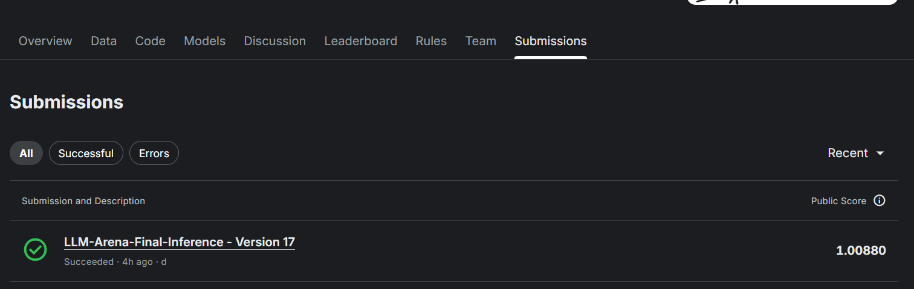
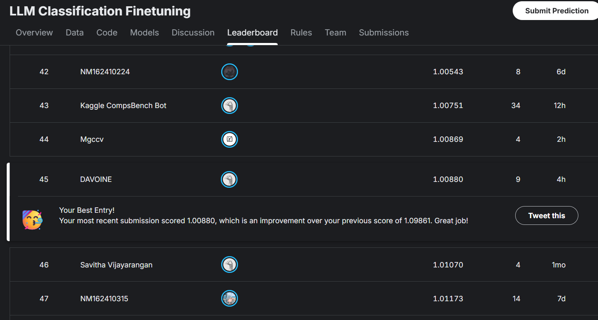
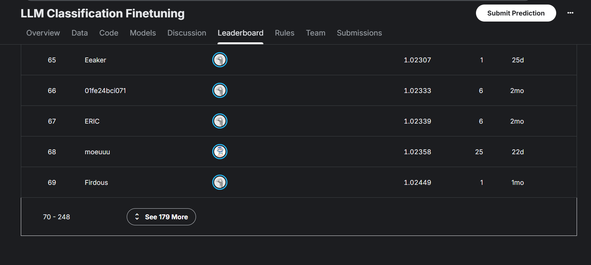

# Prédiction des préférences humaines entre réponses de LLM

<p align="left">
  
  
  
  
  
  
  
</p>

Premier projet Kaggle consacré à la prédiction des préférences humaines entre deux réponses générées par des modèles de langage.

L’objectif était de construire un modèle capable d’estimer si un évaluateur humain préférera la réponse A, la réponse B, ou considérera les deux réponses comme équivalentes.

## Résultat

- Log Loss public : **1,00880**
- Classement au moment de la capture : **45e sur 248 équipes actives**
- Position approximative : **Top 18 %**
- Résultat enregistré en **juillet 2026**

> Cette compétition utilise un classement glissant sur deux mois. Le rang indiqué correspond aux équipes actives au moment des captures d’écran et peut évoluer à mesure que de nouvelles soumissions apparaissent ou que d’anciennes expirent.

## Liens du projet

- [Compétition Kaggle — LLM Classification Finetuning](https://www.kaggle.com/competitions/llm-classification-finetuning)
- [Notebook Kaggle final — Version 17](https://www.kaggle.com/code/davoine/llm-arena-final-inference)
- [Profil Kaggle](https://www.kaggle.com/davoine)

### Résultat de la soumission



### Position dans le classement



### Taille du classement actif



## À propos de la « Version 17 »

Le notebook final est nommé `Version 17`, mais les versions précédentes correspondaient surtout à des corrections techniques du pipeline d’inférence Kaggle, et non à dix-sept modèles différents.

La Version 17 est la première soumission réussie contenant les véritables prédictions du modèle final. Après avoir obtenu une Log Loss de **1,00880** et une place dans le **Top 18 %**, j’ai choisi de figer ce résultat et de passer à un nouveau projet afin d’élargir mes compétences.

## Problème

Pour chaque exemple, les données contiennent :

- un prompt ;
- une réponse A ;
- une réponse B ;
- la préférence exprimée par un évaluateur humain.

Le modèle produit trois probabilités :

- la réponse A gagne ;
- la réponse B gagne ;
- égalité.

La métrique de la compétition est la Log Loss multiclasses. La qualité de la calibration des probabilités est donc plus importante que le simple choix de la classe la plus probable.

## Modèle final

Le système final combine :

- trois classifieurs LightGBM entraînés avec différentes graines aléatoires ;
- une régression logistique multinomiale ;
- une augmentation des données par inversion A/B ;
- une augmentation au moment de l’inférence par inversion A/B ;
- une calibration par température.

Pondération finale :

- ensemble LightGBM : **94 %**
- régression logistique : **6 %**
- température : **0,99**

L’utilisation de plusieurs graines LightGBM permet de réduire la variance des prédictions. La régression logistique apporte une composante plus linéaire et plus stable au mélange final.

## Gestion de la symétrie A/B

Le modèle reçoit les réponses dans un ordre arbitraire. Il est donc important d’éviter qu’il apprenne à favoriser systématiquement la première ou la deuxième position.

Pour limiter ce biais :

1. les réponses A et B sont inversées ;
2. une seconde prédiction est calculée ;
3. les probabilités A et B sont remises dans leur ordre initial ;
4. les prédictions originales et inversées sont moyennées.

Cette technique est utilisée pendant l’entraînement et au moment de l’inférence.

## Ingénierie des variables

Le pipeline a généré plus de **700 variables candidates** et en a retenu **143** pour le modèle final.

Les principales familles de variables comprennent :

- longueur et structure des textes ;
- similarité lexicale entre le prompt et les réponses ;
- similarité entre les réponses A et B ;
- embeddings sémantiques multilingues ;
- répétition et lisibilité ;
- respect des consignes et du format demandé ;
- couverture des sous-questions ;
- indicateurs de raisonnement et de factualité ;
- indicateurs liés au code et à la qualité technique ;
- ton, sécurité, refus et respect du rôle demandé.

### Exemples de variables

Le modèle utilise notamment :

- les écarts de longueur entre les réponses ;
- le nombre de mots, phrases, paragraphes et blocs de code ;
- la similarité de Jaccard avec le prompt ;
- la proximité sémantique entre chaque réponse et le prompt ;
- la répétition de bigrammes et trigrammes ;
- la présence de refus ou d’excuses ;
- le respect de contraintes de format ;
- la présence de code potentiellement incomplet ;
- la similarité entre les réponses A et B.

## Embeddings sémantiques

Les variables sémantiques ont été générées avec :

`sentence-transformers/paraphrase-multilingual-MiniLM-L12-v2`

Le modèle transforme les prompts et les réponses en vecteurs numériques. Le pipeline calcule ensuite différentes similarités cosinus :

- prompt complet / réponse A ;
- prompt complet / réponse B ;
- dernier tour du prompt / réponse A ;
- dernier tour du prompt / réponse B ;
- réponse A / réponse B ;
- différences entre les similarités de A et de B.

Le modèle d’embeddings est chargé localement afin que le notebook Kaggle puisse fonctionner sans accès à Internet.

## Sélection des variables

Les variables ont été évaluées à l’aide de plusieurs méthodes :

- validation croisée ;
- importance LightGBM ;
- permutation importance ;
- stabilité entre plusieurs folds ;
- validation avec plusieurs graines aléatoires ;
- comparaison de modèles utilisant différents nombres de variables.

L’objectif était de conserver les variables réellement utiles tout en limitant la redondance et le risque de surapprentissage.

## Validation

- Log Loss en validation croisée : environ **1,0092**
- Log Loss public Kaggle : **1,00880**

La proximité entre le score de validation et le score public suggère que la procédure de validation s’est correctement généralisée.

Le modèle logistique seul obtenait un score moins performant. L’ensemble LightGBM, complété par la régression logistique et la symétrisation A/B, a permis d’améliorer la Log Loss finale.

## Débogage du test caché

Une partie importante du projet a consisté à rendre le pipeline compatible avec l’environnement de soumission Kaggle.

Le test public ne contenait que trois lignes, tandis que Kaggle réexécute le notebook sur un test caché plus grand et potentiellement différent.

Plusieurs problèmes ont été corrigés :

- dépendances tentant d’accéder à Internet ;
- modèles d’embeddings portant le même nom mais produisant des valeurs différentes ;
- comparaisons avec un checkpoint public de trois lignes ;
- fonctions issues d’un export de notebook contenant du code invalide ;
- colonnes supprimées dynamiquement en fonction des valeurs du test ;
- consommation mémoire des embeddings ;
- lignes inhabituelles pouvant faire échouer une famille entière de variables ;
- différences entre le pipeline d’entraînement et le pipeline d’inférence.

La reconstruction finale des 143 variables a été vérifiée sur le test public avec une différence numérique maximale d’environ `1,8 × 10⁻⁷`, soit une différence négligeable liée aux arrondis en `float32`.

## Technologies utilisées

- Python
- pandas et NumPy
- scikit-learn
- LightGBM
- Sentence Transformers
- PyTorch
- Hugging Face Transformers
- Jupyter Notebook
- Kaggle
- Git et GitHub

## Structure du dépôt

```text
.
├── notebooks/
│   └── final-inference-v17.ipynb
├── images/
│   ├── leaderboard-rank-45.png
│   ├── leaderboard-248.png
│   └── submission-score.png
├── reports/
├── README.md
├── requirements.txt
└── .gitignore
```

## Reproductibilité

Le dépôt ne contient pas :

- les données de la compétition Kaggle ;
- les modèles entraînés au format `.joblib` ;
- les checkpoints volumineux du modèle d’embeddings ;
- les fichiers intermédiaires au format `.parquet`.

Ces fichiers sont exclus pour des raisons de licence, de taille et de reproductibilité.

Pour reproduire complètement le pipeline, il faut récupérer les données depuis Kaggle et fournir localement les artefacts de modèles nécessaires. Le notebook Kaggle public permet également de consulter l’environnement et le pipeline utilisés pour la soumission finale.

## Limites

- Le modèle tabulaire ne vérifie pas directement la véracité factuelle des réponses.
- Les variables liées au code analysent sa structure mais ne l’exécutent pas.
- De nombreuses variables reposent sur des règles linguistiques conçues manuellement.
- L’encodeur sémantique reste plus léger qu’un grand transformer entraîné directement sur cette tâche.
- Le classement Kaggle étant glissant sur deux mois, le rang affiché peut évoluer.

## Points clés

Ce projet met en œuvre un pipeline complet de machine learning comprenant :

- ingénierie de variables ;
- validation croisée ;
- sélection de variables ;
- combinaison de plusieurs modèles ;
- calibration des probabilités ;
- gestion de la symétrie par inversion A/B ;
- inférence hors ligne sur un test caché ;
- déploiement et débogage sur Kaggle.